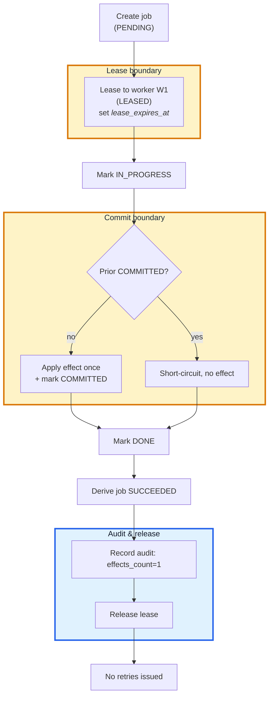

# Baseline Happy Path

Concise reference for the non-failure flow. Rules live in `docs/01_invariants.md`; state transitions live in `docs/02_state_model.md`. This page only pins the happy-path ordering and where we check the boundaries.

---

## Canonical sequence

- Output constraints:
  - one logical effect
  - one COMMITTED execution per job_id
  - zero retries.
- Idempotency boundary
  - sits at `COMMITTED`
  - side effects are illegal before it ([INV_001](./01_invariants.md#inv_001----job-execution-is-logically-idempotent)/[INV_002](./01_invariants.md#inv_002----partial-execution-must-not-leave-irreversible-damage)).
- Transition order mirrors the execution machine from [`state_model`](./02_state_model.md)
  - jobs stay derived (see [`state_model`](./02_state_model.md)).

---

## Lease eligibility (summary)

- **Leasable**: never leased, or lease expired with no terminal success.
- **Not leasable**: latest execution `DONE`, or an unexpired lease exists.

This is the minimum needed for `at-least-once` delivery while avoiding duplicate effects.

---

## Invariant touchpoints

- Lease grant asserts INV_003 (explicit states) and sets up INV_004 (recoverable retries).
- Commit boundary enforces INV_001 / INV_002 (single effect, crash-safe).
- Audit after `DONE` keeps INV_005 observable.

Details stay centralized in `docs/01_invariants.md` to avoid drift.

---

## Failure hook for FM_001

Injection point: between `IN_PROGRESS` and `COMMITTED` (see [`FM_001 spec`](../failure_modes/FM_001_duplicate_retry/spec.md)).  
Scenario: 
  - Worker A times out before commit; 
  - Worker B retries and would double-apply unless the commit boundary short-circuits (policy in [`policies`](./03_policies.md#commit-boundary-idempotency)).
